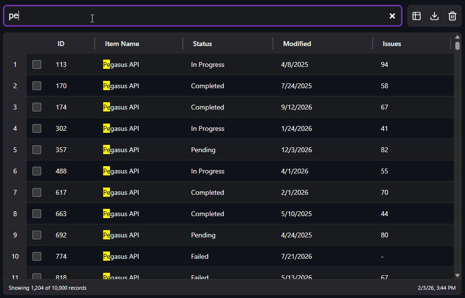

# YATL (Yet Another Table Library)

[](https://www.npmjs.com/package/@timlassiter11/yatl)
[](LICENSE)

YATL is a powerful, feature-rich, and lightweight Web Component data table built with Lit. It handles large datasets with ease using virtual scrolling, offers advanced fuzzy search capabilities, supports state persistence, and works in any framework (React, Vue, Angular, or Vanilla JS).

[Try the Live Demo](https://timlassiter11.github.io/YATL/) | [Check out the Docs](https://timlassiter11.github.io/YATL/docs/core/index.html)



## Why?!?

I needed a free and simple table library for vanilla JS that was easy to customize and could handle large datasets... so I created YATL. As the project that I wrote this for grew, so did this library. Now it is a web component built using Lit that is fairly feature rich for simple use cases. There are many other great table libraries out there but if you want something simple to just drop in but with all of the major features already included, YATL might be for you.

## Features

- **Virtual Scrolling**: Render 100,000+ rows smoothly with virtual scrolling.
- **Smart Search**: Tokenized fuzzy search with relevance scoring and highlighting.
- **State Persistence**: Automatically save and restore column order, visibility, sort, and widths to LocalStorage.
- **Highly Customizable**: Slot support, CSS Shadow Parts, and custom cell renderers.
- **Interactive**: Drag-and-drop column reordering, multi-column sorting (`SHIFT+CLICK`), and resizeable headers.
- **Export**: Built-in CSV export for visible or all data.
- **Type Safe**: Generic component with full type hint support.

## Installation

The recommend method is to use npm.

```bash
npm install @timlassiter11/yatl
```

Alternatively you can manually download the source files from the [releases](https://github.com/timlassiter11/YATL/releases) section.

## Examples

### Lit

```ts
import { html, LitElement } from 'lit';

import { ColumnOptions, YatlRowClickEvent } from '@timlassiter11/yatl';
import { customElement, state } from 'lit/decorators.js';

type User = { id: number; name: string; dateCreated: Date };

@customElement('my-component')
export class MyComponent extends LitElement {
  private dateFormatter = Intl.DateTimeFormat(undefined, {
    dateStyle: 'short',
    timeStyle: undefined,
  });

  private colums: ColumnOptions<User>[] = [
    {
      field: 'id',
      title: 'ID',
      resizable: true,
      sortable: true,
      searchable: false,
    },
    {
      field: 'name',
      resizable: true,
      sortable: true,
      searchable: true,
      tokenize: true,
    },
    {
      field: 'dateCreated',
      resizable: true,
      sortable: true,
      searchable: false,
      valueFormatter: value => this.dateFormatter.format(value as Date),
    },
  ];

  @state()
  private data: User[] = [
    { id: 0, name: 'Bjarne Stroustrup', dateCreated: new Date(1968, 11, 30) },
    { id: 1, name: 'Guido van Rossum', dateCreated: new Date(1974, 0, 31) },
  ];

  protected override render() {
    return html`
      <yatl-table
        .columns=${this.colums}
        .data=${this.data}
        enable-virtual-scroll
        @yatl-row-click=${this.handleRowClicked}
      >
      </yatl-table>
    `;
  }

  private handleRowClicked = (event: YatlRowClickEvent<User>) => {
    console.log(event.detail);
  };
}
```

### Vanilla JS

```html
<!DOCTYPE html>
<html lang="en">
  <head>
    <meta charset="utf-8" />
    <title>Basic Example</title>
    <style>
      body {
        height: 100vh;
        width: 100vw;
        margin: 0;
        padding: 20px;
        box-sizing: border-box;
      }
    </style>
  </head>

  <body>
    <yatl-table sortable resizable enable-footer></yatl-table>
    <script src="../dist/yatl.min.global.js"></script>
    <script>
      window.addEventListener('load', () => {
        const table = document.querySelector('yatl-table');
        table.columns = [
          {
            field: 'index',
            title: 'ID',
          },
          {
            field: 'name',
          },
          {
            field: 'value',
          },
        ];

        // Generate random rows of data
        table.data = new Array(100).fill(null).map((v, i) => ({
          index: i,
          name: `Row ${i}`,
          value: Math.random() * 1000,
        }));

        table.addEventListener('yatl-row-click', event => {
          console.log(event.detail);
        });
      });
    </script>
  </body>
</html>
```

## Styling Guide

YATL Table is built with extensive CSS Custom Properties (variables) to make theming easy. Styles are scoped to the shadow DOM, but you can control them from anywhere in your application (e.g., :root or a parent container) using the provided --yatl-table-\* variables.

### Quick Start

You can apply styles directly to the component or inherit them globally.

```css
/* Apply globally */
:root {
  --yatl-table-font-size: 1rem;
  --yatl-table-bg-light: #fdfdfd;
}

/* Or scope to a specific class */
.my-custom-table {
  --yatl-table-border-color: #ccc;
  --yatl-table-header-bg: #eee;
}
```

### CSS Variables Reference

#### Typography

| Variable                 | Description                      |
| ------------------------ | -------------------------------- |
| --yatl-table-font        | The font family stack.           |
| --yatl-table-font-size   | Base font size for all text.     |
| --yatl-table-line-height | Line height for text legibility. |

#### Spacing & Layout

| Variable                    | Description                                       |
| --------------------------- | ------------------------------------------------- |
| --yatl-table-cell-padding   | Padding inside standard body cells.               |
| --yatl-table-header-padding | Padding inside header cells.                      |
| --yatl-table-resizer-width  | The width of the "grab" area for column resizing. |

#### Color Variables

| Variable                     | Description                                    |
| ---------------------------- | ---------------------------------------------- |
| --yatl-table-bg              | Main background color of the table.            |
| --yatl-table-text            | Primary text color.                            |
| --yatl-table-text-muted      | Secondary/footer text color.                   |
| --yatl-table-border-color    | Border color for rows and the table container. |
| --yatl-table-header-bg       | Background for the sticky header row.          |
| --yatl-table-header-text     | Text color for the header row.                 |
| --yatl-table-row-hover-bg    | Background color when hovering over a row.     |
| --yatl-table-row-selected-bg | Background color for selected rows.            |

**NOTE**: For each color variable, there is a dedicated `-light` and `-dark` variable. See [Color Scheme](#color-scheme) below for more info.

### Color Scheme

By default, this component adapts to the current `color-scheme` by utilizing the [light-dark()](https://developer.mozilla.org/en-US/docs/Web/CSS/Reference/Values/color_value/light-dark) CSS function. This will automatically adjust to the system theme, but can be manually overridden. If you have a theme toggler, you should have it set the document `color-scheme`. Below is an example assuming you set a `light` or `dark` class on your document element.

```css
:root {
  color-scheme: light dark;
}

:root.light {
  color-scheme: light;
}

:root.dark {
  color-scheme: dark;
}
```

To force a color regardless of the current color scheme, you can override the base variable.

```css
:root {
  /* Always dark background */
  --yatl-table-bg: #212121;
}
```

If you want to update a color for one of the color schemes, use the specific theme variable instead.

```css
:root {
  /* light background */
  --yatl-table-bg-light: #e0e0e0;
  /* dark background */
  --yatl-table-bg-dark: #202020;
}
```

### CSS Shadow Parts

For deeper customization beyond color and spacing, you can target specific elements using the ::part pseudo-element.

```css
yatl-table::part(header) {
  text-transform: uppercase;
  letter-spacing: 0.05em;
}
```

#### Parts Reference

| Part Name        | Description                                     |
| ---------------- | ----------------------------------------------- |
| table            | The main container grid.                        |
| header           | The container for the header row.               |
| header-cell      | Individual header cells.                        |
| header-title     | The text span inside a header cell.             |
| header-sort-icon | The sorting arrow icon.                         |
| header-resizer   | The drag handle for resizing columns.           |
| row              | The container for a data row.                   |
| cell             | Targets all cells (both header and body).       |
| body-cell        | Targets only data cells (not headers).          |
| footer           | The footer container.                           |
| message          | The empty state / no results message container. |

### Common Recipes

#### Zebra Striping

You can use standard pseudo-classes like :nth-child combined with ::part.

```css
/* Stripe every even row */
yatl-table::part(row):nth-child(even) {
  background-color: #f9f9f9;
}

/* Add a hover effect to rows */
yatl-table::part(row):hover {
  background-color: #e0f2fe;
  cursor: pointer;
}
```

#### Targeting Specific Columns

Every cell automatically gets a part name based on its field property in the format cell-{field}.

For example, if you have a column defined as `{ field: 'status' }`:

```css
/* Center the 'status' column and make it bold */
yatl-table::part(cell-status) {
  justify-content: center; /* Flex alignment */
  font-weight: bold;
  text-align: center;
}

/* Set a specific width or background for the ID column */
yatl-table::part(cell-id) {
  background-color: #f1f5f9;
  font-family: monospace;
}
```

#### Conditional Row Styling

You can style rows based on their data using the rowParts property in JavaScript combined with CSS.

```js
const table = document.querySelector('yatl-table');

// Return a string (or array of strings) to add to the row's parts
table.rowParts = row => {
  const parts = [];
  if (row.stock < 5) parts.push('low-stock');
  if (row.price > 1000) parts.push('expensive');
  return parts;
};
```

```css
/* Style rows tagged as 'low-stock' */
yatl-table::part(low-stock) {
  background-color: #fef2f2; /* Light red */
  border-left: 4px solid #ef4444;
}

/* Style rows tagged as 'expensive' */
yatl-table::part(expensive) {
  color: #0f172a;
  font-weight: 600;
}
```

#### Customizing the Footer

```css
yatl-table::part(footer) {
  background-color: #1e293b;
  color: white;
  padding: 1rem;
}
```

### Virtual Scroll

Virtual scrolling is used to render only the rows that are visible (with some extras before and after). This allows the library to support tables with hundreads of thousands of rows without issue. This is done using `lit-virtualizer` and requires it's parent enforce a height. To do this you can simply add a height to the table.

```html
<body>
  <yatl-table style="height: 500px;"></yatl-table>
</body>
```

Most of the time this isn't ideal though and instead we'd like to let the layout work it's magic. To do this, it's best to wrap the table in an element that can enforce a height.

```html
<body style="height: 100vh;">
  <div style="display: flex;">
    <div>... Lot's of cool table controls or filters</div>
    <yatl-table style="flex-grow: 1;"></yatl-table>
    <div>... Some boring footer info or something</div>
  </div>
</body>
```
